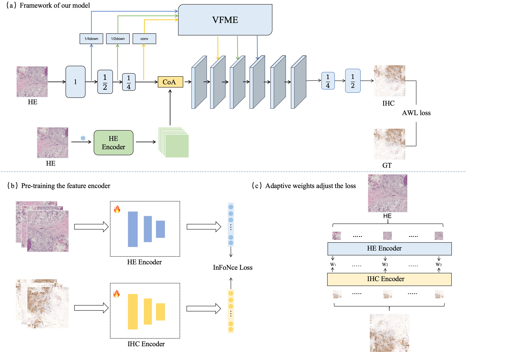

# Adaptive IHC Virtual Staining via Contrastive-Encoding Feature Fusion
## Method

## Requirements
To create and activate a Conda environment, use the following commands:

```bash
conda create -n CEFF python=3.11 
conda activate CEFF
pip install -r requirements.txt
```

## Training
The dataset is constructed as the following format:
```bash
datasets
├── BCI
│   ├── test
│   │   ├── test1.png
│   │   ├── test2.png
│   │   ├── ...
│   ├── train
│   │   ├── train1.png
│   │   ├── train2.png
│   │   ├── ...
├── PR
│   ├── test
│   │   ├── test1.png
│   │   ├── test2.png
│   │   ├── ...
│   ├── train
│   │   ├── train1.png
│   │   ├── train2.png
│   │   ├── ...
├── ...
```

Taking BCI challenge dataset as an example,for the training of encoder,run:

```bash
python train.py --dataroot root --model Encoder --name BCI --batch_size 64 --crop_size 256 --n_epochs 200 --n_epochs_decay 100
```
For the training of the model,run:
```bash
python train.py --dataroot ./datasets/BCI  --name BCI --dataset_name BCI
```

## Test and evaluate
To test the model,you can run:
```bash
python test.py --dataroot ./datasets/BCI   --name BCI
```
To evaluate the model,you can run:
```bash
python evaluate.py --result_path ./results/BCI
```
## Pre_trained models
You can download pre_trained models here:

[](https://drive.google.com/file/d/1-ywaEGKCqzxB5-YUWSipOz4WTHUn6fIE/view?usp=sharing)
You can extract this file and place it in the checkpoints folder to use it.
